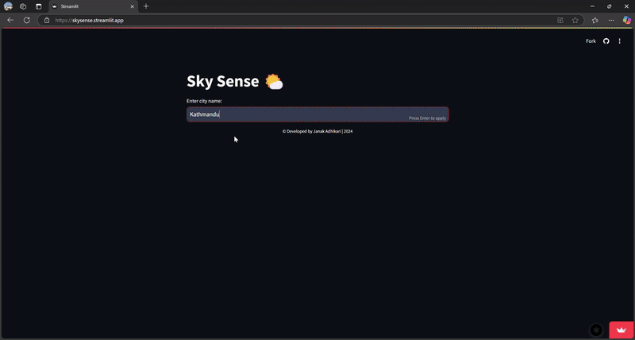

# SkySense 🌤️

SkySense is a dynamic weather prediction app that leverages **Bayesian inference** to provide accurate, real-time weather forecasts based on user input and environmental data. By asking simple, intuitive questions, SkySense adapts its predictions to the most relevant factors, such as current weather patterns, location, and historical trends. Whether it's predicting rain, wind conditions, or temperature shifts, SkySense delivers personalized, data-driven forecasts without requiring users to input complex prior knowledge.

With its sleek, user-friendly interface, SkySense makes understanding the weather easy and accessible for everyone, anytime, anywhere.

---

## Features

- **Bayesian Inference**: Utilizes Bayesian probability to predict weather outcomes based on conditional probabilities and user confidence.
- **Real-Time Weather Data**: Fetches current weather conditions from [OpenWeatherMap API](https://openweathermap.org/).
- **Dynamic Predictions**: Adapts predictions based on user input and current weather conditions.
- **User-Friendly Interface**: Simple input forms and intuitive design to make weather predictions accessible to everyone.

---

## Demo

Here's a quick demo of SkySense in action:

